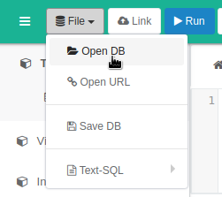
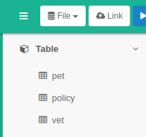
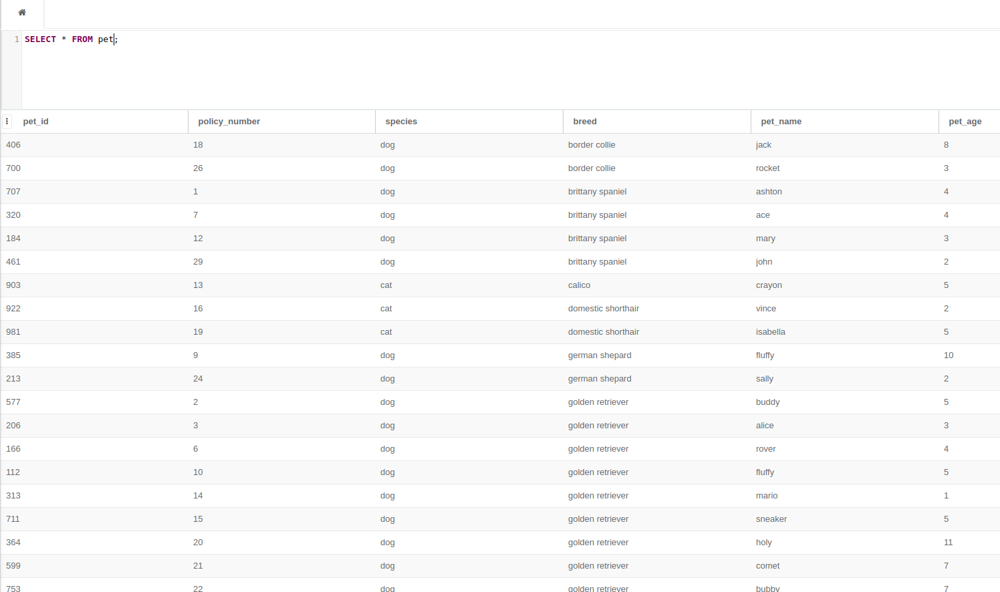

# Pet / Vet / Policy Database :dog2: :scream_cat:

### Contents:

* A folder, raw_data, which contains all tables (pet, vet, policy) in their raw .csv files
* A database, pet_vet_policy.db, which can be used to import all three .csv files above into a sqlite3 database. The .db file is simply the .csv files 'wrapped up' in a format that is easily recognized to sqlite databases.

### Importing Files:

* Go to [sqliteonline](https://sqliteonline.com/)
* Click on File -> Open DB

* Navigate to the [pet_vet_policy.db](../../pet_vet_policy.db) file within this folder
* Click the drop-down arrow next to 'Table' within the sqlite browser window
* You should see three new tables: pet, policy, and vet

* Verify the tables can be read by typing the following and hitting SHIFT+Enter to execute the code:

  `SELECT * FROM pet;`

* A table should appear within the lower right pane of the browser window reporting the contents of the pet table

